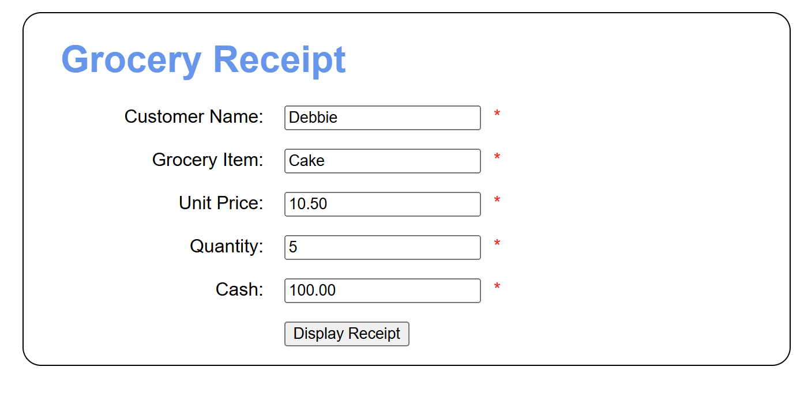
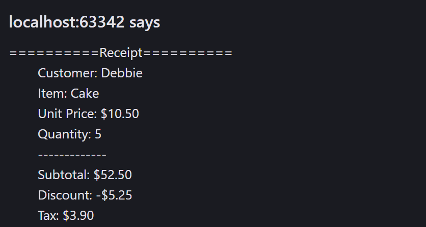
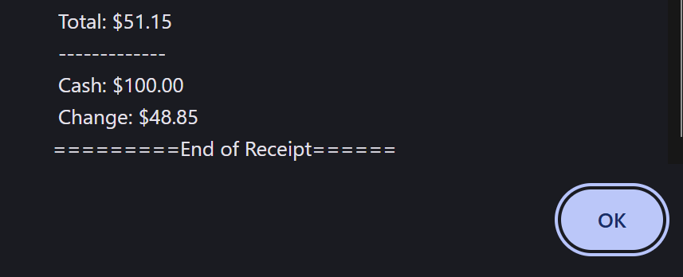
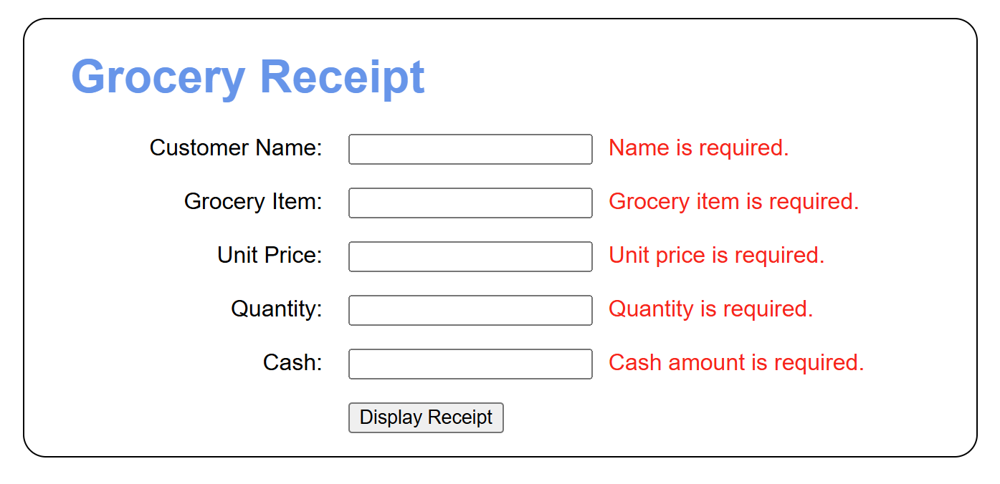
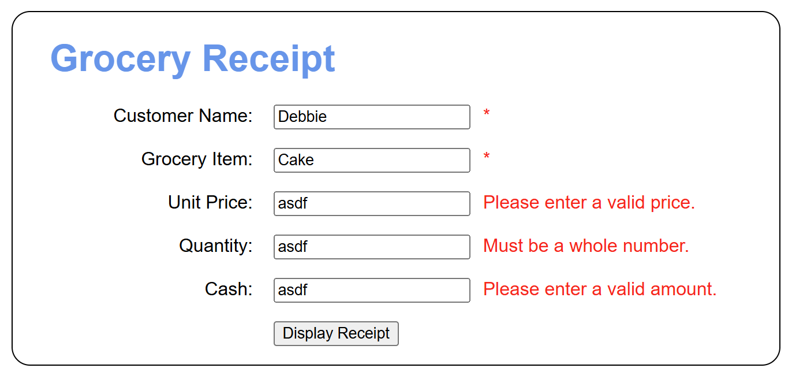
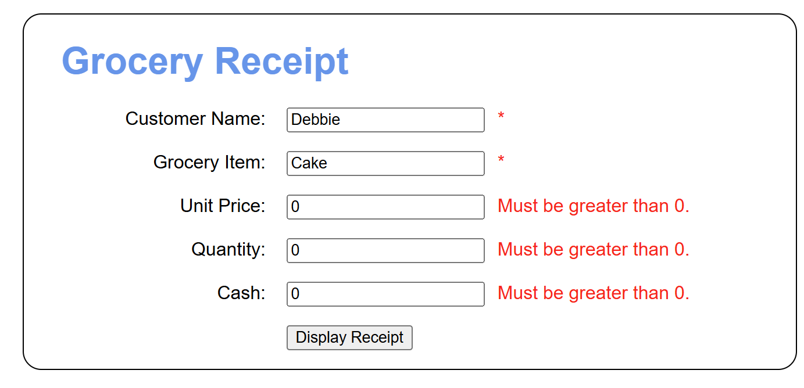

# Simple Checkout

<b>Table of Contents</b>
- [Summary](#summary)
- [Screenshots](#screenshots)
    - [Valid Form](#valid-form)
    - [Receipt](#receipt)
    - [Data Validation](#data-validation)
- [Maintainers](#maintainers)

# <u>*Summary*</u>

Welcome to the Simple Checkout App!
--------------------------------
A grocery checkout app doesn't get simpler than this. Wanna see what a little JavaScript can do for your site then give this a try! 
 
The purpose of this program is to simulate a simple grocery check out as a web application. Just fill out the fields, click "Display Receipt", and watch the magic! 

# <u>*Screenshots*</u>

## Valid Form

## Receipt

## Data Validation

# <u>*Maintainers*</u>
[@Tarath01](https://github.com/tarath01) Taylor Rath  
[@bstearns07](https://github.com/bstearns07) Ben Stearns

[Back to Top](#simple-checkout)
